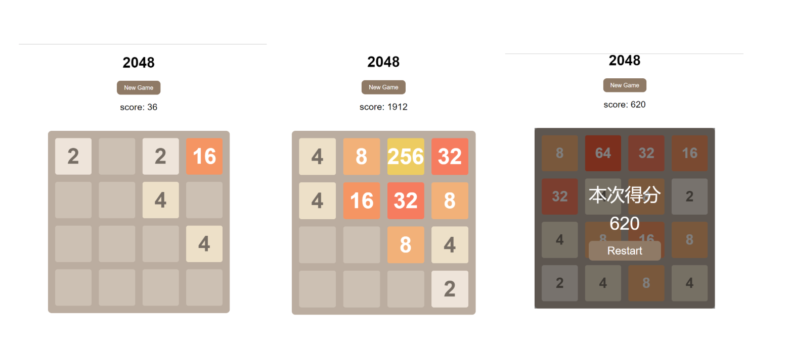

# 游戏介绍
## 关于《2048》
《2048》是比较流行的一款数字游戏。原版2048首先在github上发布，原作者是Gabriele Cirulli。它是基于《1024》和《小3传奇》的玩法开发而成的新型数字游戏。
随后2048便出现各种版本，走各大平台。由Ketchapp公司移植到IOS的版本最为火热，现在约有1000万下载，其名字跟原版一模一样。衍生版中最出名的是《2048六边形》版本，先后在全球81个国家中的board game中排进了前200。安卓版非常火爆的有《挑战2048》，其2.0.0版以后还加入了双人对战。其次比较特别的有2048中国朝代版。更有2048自定义版，可以自己定义文字和图片。《2048》是IOS中流行的一款。
## 游戏演示

## 使用技术
1. HTML
2. CSS
3. Javascript
4. jQuery

## 游戏架构
1. index.html：游戏页面
2. game.css：游戏样式
3. jquery.js：jQuery文件
4. support.js：游戏基础逻辑文件
5. animation.js：游戏动画逻辑文件
6. main.js：游戏主逻辑文件
7. game.js：游戏交互逻辑文件